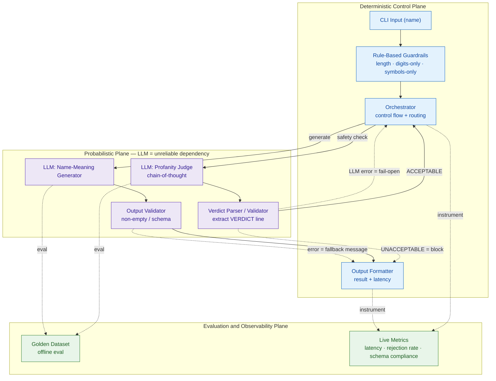

# Project Pixie — High-Level Design

Pixie is a **local AI agent** (Ollama · Llama 3.2) that returns the meaning of a name, behind layered safety guardrails.

Architecturally it is a **deterministic shell around a probabilistic core**: the only non-deterministic parts are the two LLM calls; everything else is deterministic and designed the conventional way.

---

## Design principle: shell vs. core

You cannot design an LLM's output as a fixed value — it is probabilistic. So we don't try. We keep the model call small and **wrap it in a deterministic shell**, treating each LLM exactly like an **unreliable third-party API**:

| Concern | How we handle it (same as any flaky dependency) |
|---|---|
| Output isn't guaranteed | Validate/parse the response before trusting it |
| It can fail or time out | Explicit fallback (fail-open or fail-closed) |
| It's non-deterministic | Constrain it (prompt contract, low temperature, parseable output) |
| You can't unit-test exact output | **Measure** it statistically with a golden dataset |

> **Rule of thumb:** deterministic components you *prove correct* (unit tests); probabilistic components you *measure and contain* (evals + validators).

---

## Architecture

---

## The three planes

### 1. Deterministic Control Plane
Pure, testable logic. Given the same input it always behaves the same way.
- **CLI I/O** — read a name, handle the exit command.
- **Rule-based guardrails** — length > 50, digits-only, symbols-only. Cheap and certain, so they run **first** (fail fast before spending an LLM call).
- **Orchestrator** — sequences the pipeline and routes on guardrail results.
- **Output formatter** — prints the meaning + latency.

*Verification: standard unit tests asserting exact outputs.*

### 2. Probabilistic Plane
Two LLM components, each treated as an unreliable dependency wrapped in a contract:

| LLM component | Input contract | Expected output **shape** | Validator | Fallback | Non-determinism control |
|---|---|---|---|---|---|
| **Profanity Judge** | the name | a `VERDICT: ACCEPTABLE / UNACCEPTABLE` line after reasoning | parse the **VERDICT line** (not a substring scan) | on error → **fail-open** (allow) | low temperature; force a fixed verdict token |
| **Name-Meaning Generator** | the name | short natural-language meaning | non-empty / basic schema check | on error → user-facing error message | keep prompt tight and short |

*Verification: not exact-match — measured on the golden dataset.*

### 3. Evaluation & Observability Plane
The plane deterministic systems don't have — and the reason you can trust a probabilistic system.
- **Golden dataset** (`tests/goldendataset.xlsx`) — offline evaluation of meaning quality against known-good answers.
- **Live metrics** (`METRICS`) — latency (target < 10s), guardrail rejection rate, schema-compliance rate.

---

## Key design decisions

1. **Layer guardrails cheapest-first** — deterministic rules before the probabilistic LLM judge. Most bad input is rejected for free.
2. **Chain-of-thought + a parseable verdict** — let the judge reason, but end on a machine-readable `VERDICT:` line so the shell can act on it deterministically.
3. **Fail-open on the safety judge** — availability over strictness (a name-meaning toy). *A higher-stakes system would fail-closed — this is a deliberate, documented trade-off.*
4. **Evaluation is first-class**, not an afterthought — quality is proven statistically, not by logic.

---

## Known refinements (honest backlog)

- **Verdict parsing:** today the check is `"UNACCEPTABLE" in text`, which can false-trigger when the chain-of-thought *reasoning* uses the word. Extract and check **only the final VERDICT line**.
- **Stabilize the judge** with an explicit low temperature and/or structured (JSON) output.
- **Schema-compliance metric** is currently hard-coded to 100% — wire it to the real validator result.

---

*Part of Project Pixie · `03_architecture`. Problem first, evaluation as part of the product.*
